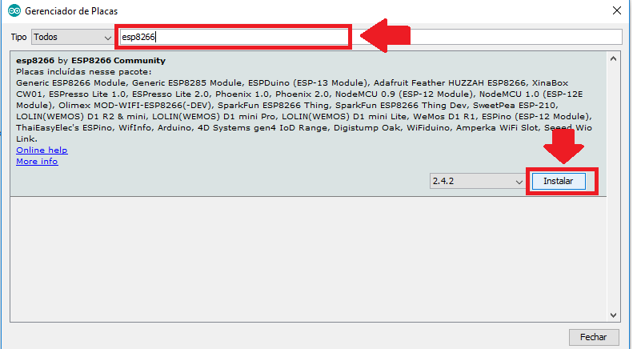
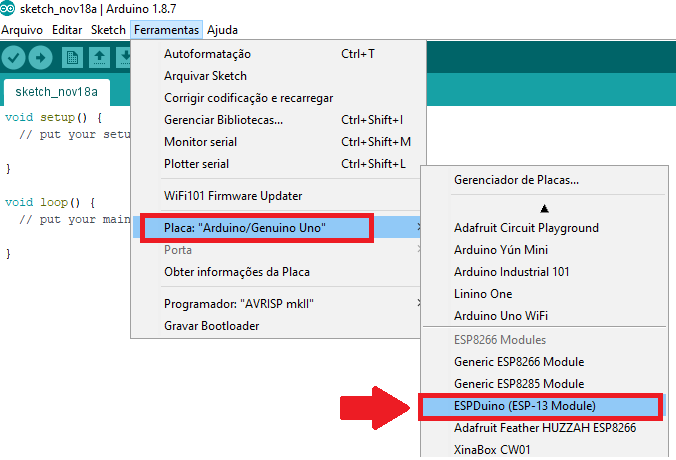
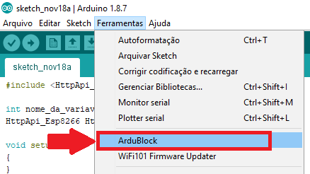
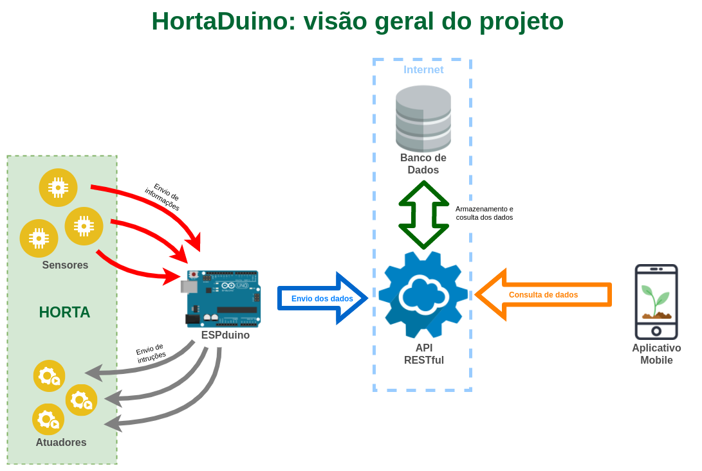
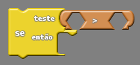
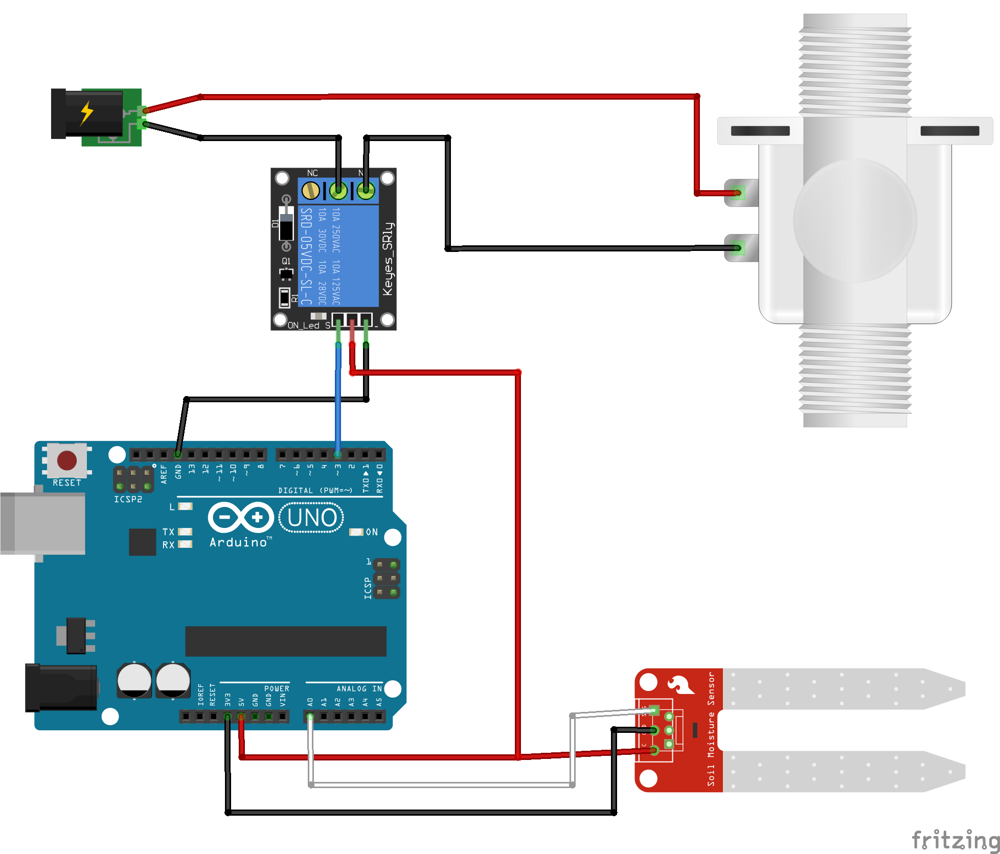
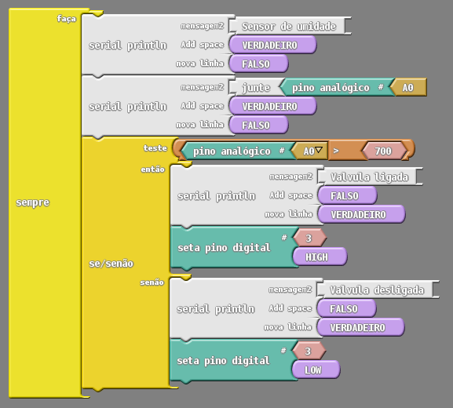

# HortaDuino: Irrigação e monitoramento de uma horta escolar com ESPduino

Com a tecnologia evoluindo em uma velocidade nunca antes vista, atualmente saber programação já é quase que indispensável para acompanhar e usufruir das novas facilidades que surgem diariamente. Assim, os conceitos relativos à lógica computacional estão sendo introduzidos para as crianças e jovens cada vez mais cedo, principalmente em países desenvolvidos. Porém, mesmo com um crescente número de iniciativas que auxiliam no ensino de programação nas escolas, os professores (ou tutores) ainda enfrentam alguns desafios na hora de transmitir os conhecimentos da lógica computacional e, a escolha de uma abordagem didática adequada, pode fazer toda diferença, tanto para quem está ensinando, quanto para os alunos que estão aprendendo.

Desta forma, recursos como as placas de prototipagem de hardware e eletrônica podem ser grandes facilitadores na construção de uma boa didática para o ensino de programação, já que possibilitam explorar tanto a criatividade do aluno para "construir" uma solução, quanto dar "vida" e movimento a esses recursos físicos por meio da programação. Isso possibilita que se explore não somente conhecimentos relacionados à programação, mas também à integração desses com o ambiente no qual a escola e o aluno estão inseridos.

Pensando nisso, o "HortaDuino" surge com o intuito de explorar o ensino de programação por meio de um projeto de irrigação e monitoramento de uma horta escolar, ambiente que possui um grande potencial interdisciplinar e que, por meio da utilização de sensores e atuadores da plataforma ESPduino, fornece uma infinidade de possibilidades para criação de atividades que mostrem as aplicações práticas do "poder" da programação no cotidiano dos alunos. O HortaDuino, é embasado em uma pesquisa detalhada sobre as melhores opções de materiais e ferramentas para esse tipo de proposta, bem como, em um cuidadoso planejamento da melhor forma de integrar os recursos de ensino de programação disponíveis atualmente. Todo esse trabalho que deu origem a proposta do HortaDuino foi tema de um trabalho de graduação do Curso de Ciência da Computação da UFSM e está [disponível para consulta]().

A seguir, são descritas todas as etapas para a replicação da ideia do HortaDuino, desde os materiais necessários, a explicação detalhada da integração dos sensores com os atuadores até a criação dos códigos para o ESPduino.  

# Sumário

 
# Materiais Necessários

Abaixo está uma tabela contendo a relação dos materiais essenciais para a execução do projeto, nela são apresentados os preços médios dos componentes e sugestões de onde podem ser comprados. Esses materiais foram escolhidos criteriosamente, objetivando a seleção dos recursos com melhor custo benefício para o projeto, assim, esse levantamento realizado justifica cada um das escolhas de materiais e, principalmente, o motivo do uso da placa de prototipagem ESPduino para a realização da proposta do HortaDuino. A compararação das listas de materiais utilizando o Arduino e utilizando o ESPduino como opção pode ser consultada em: [Comparação das listas de materiais]()


<div align="center">

   Imagem                                      |                 Material                 | Preço médio (R$) |  Onde comprar
---------------------------------------------- | ---------------------------------------- | ---------------- | --------------------     
 |    Válvula solenóide 1/2' x 1/2' 12v     |   **R$ 40,10**   |  [OPÇÃO 1](https://bit.ly/2Py4RLo) <br> [OPÇÃO 2](https://bit.ly/2Q445p6)       
 |            ESPduino + Cabo USB           |   **R$ 55,00**   |  [OPÇÃO 1](https://bit.ly/2Q2MoWU)<br>[OPÇÃO 2](https://amzn.to/2TnfVJJ)
 |            Módulo Relé 12v 10A           |   **R$ 10,00**   |  [OPÇÃO 1](https://bit.ly/2S20MMp)<br>[OPÇÃO 2](https://bit.ly/2OPRC3B)         
 |       Fonte de alimentação 12v 1A        |   **R$ 15,00**   |  [OPÇÃO 1](https://bit.ly/2A4j4Fz)<br>[OPÇÃO 2](https://bit.ly/2lEEPVj)  
 |  Sensor de umidade do solo (higrômetro)  |   **R$ 9,50**    |  [OPÇÃO 1](https://bit.ly/2hlvfqr)<br>[OPÇÃO 2](https://bit.ly/2x327bU)
 | Mangueira de gotejamento (microperfurada)|   **R$ 30,00**  | [OPÇÃO 1](https://bit.ly/2Ttl9Um)<br>[OPÇÃO 2](https://bit.ly/2TqJOsm)<br> * Em lojas de ferragens é possível <br> comprar por metro, saindo mais <br> barato que o rolo todo </li>

Preços atualizados no dia 17/11/2018      

### **Preço Total : R$ 159,60**
</div>

É importante ressaltar que os preços médios apresentados na tabela não consideram os custos com frete para a antrega dos materiais.

<br>

<a name="soft"></a>

# Software

Para a programação do ESPduino são necessárias algumas ferramentas de software com determinadas configurações. O processo de instalação, configuração e adição dos recursos necessários para o HortaDuino são descritos nos próximos itens.
________________________________
## Instalação do Arduino IDE
________________________________

Como ambiente de programação vamos usar o Arduino IDE, editor comumente usado para a criação e envio dos programas para placas de prototipagem como o Arduino e ESPduino. Para instalá-lo basta seguir os seguintes passos:

1. Entre no site [https://www.arduino.cc/en/Main/Software](https://www.arduino.cc/en/Main/Software) e baixe o arquivo .ZIP, conforme a imagem abaixo:


2. Escolha o **Disco Local (C:)** como destino para o arquivo:  


3. Descompacte o arquivo .ZIP baixado;

4. Entre na pasta descompactada e busque pelo ícone do Arduino referente ao executável do Arduino IDE. Para facilitar os posteriores usos, sugere-se a criação de um atalho na Área de Trabalho:  


5. Pronto, instalação concluida!

## Instalação do plugin ESP8266 para uso do ESPduino no Arduino IDE


Como estamos usando o ESPduino como placa de prototipagem e o Arduino IDE é nativamento voltado para o uso com o Arduino, é necessário a instalação do plugin do ESP8266 (microcontrolador do ESPduino) para que possamos programarmos a placa de prototipagem. A instalação desse plugin pode ser feita seguindo os passos abaixo:

 1. Com o Arduino IDE aberto, abra o menu "Arquivo > Preferências" e em seguida, no campo "URLs Adicionais para gerenciadores de Placas" adicione o seguinte link:  
```
    http://arduino.esp8266.com/stable/package_esp8266com_index.json
```


2. Acesse o menu "Ferramentas > Placa > Gerenciador de Placas", conforme a imagem:     


3. Em seguida, procure por "esp8266 Community" e clique em instalar.  


4. Reinicie o Arduino IDE e a opção "ESPduino" já estará entre as placas disponíveis.  


## Adição das bibliotecas necessárias

Além da instalação do plugin, para que o ESPduino funcione perfeitamente com o Arduino IDE, precisamos incluir algumas bibliotecas na pasta "libraries" localizada na pasta onde o Arduino IDe foi intalado. O processo de adição dessas bibliotecas é bem simples:

1. Baixe o arquivo [libraries.zip](arquivos/libraries.zip) e descompacte-o;
2. Após a descompactação haverá uma pasta "libraries", com 3 outras pastas dentro. Selecione todas essas 3 pastas e copie-as:  


3. Vá até a pasta que o Arduino IDE está instalado, procure a pasta "libraries" e cole as 3 pastas copiadas do arquivo baixado para dentro dela.  


4. Por fim, basta reiniciar o Arduino IDE para que as novas bibliotecas sejam carregadas.

* *Caso o Arduino IDE informar que são necessárias atualizações nas bibliotecas: "HttpApi_Esp8266", "Duinoedu_ESP8266" e "ArduinoJson", **NÃO AS ATUALIZE**, pois isso poderá ocasionar mal funcionamento em alguns recursos do Ardublock.*

## Instalação do Ardublock

Como o HortaDuino se apresenta como uma proposta para o ensino de programação nas escolas, um fator de grande importância que também foi pensado é as formas de abstrair a complexidade dos códigos da programação das placas de prototipagem, já que comumente são usadas linguagens como C/C++ que adicionam um certo grau de complexidade no aprendizado, pois possuem uma sintaxe bem robusta e que pode acabar prejudicando o aprendizado da lógica computacional. Desta forma, toda a programação do ESPduino será feita através de programação visual, ou seja, por um recurso que possibilita a programação por meio de blocos de encaixe, semelhantes a um quebra-cabeças cuja lógica do programa é contruida ao conectar os blocos referentes a cada instrução do programa.

A opção de programação visual utilizada no HortaDuino é o Ardublock, uma plataforma de programação com blocos visuais bastante difundida entre os usuários de Arduino. Entretanto, como em nosso projeto estamos usando o ESPduino, usaremos uma versão modificada do Ardublock, dotada de blocos específicos para a programação do ESPduino.

A instalação dessa versão modificada do Ardublock é bem simples, sendo bastante semelhante a adição de novas bibliotecas. Abaixo o passo a passo da instalação:

1. Baixe o arquivo [tools.zip](arquivos/tools.zip) e descompacte-o;
2. Após a descompactação haverá uma pasta "tools". Dentro dela está a pasta "ArduBlockTool", selecione-a e a copie:   


3. Vá até a pasta que o Arduino IDE está instalado, procure a pasta "tools" e cole a pasta "ArduBlockTool" copiada do arquivo baixado para dentro dela.  


4. Por fim, basta reiniciar o Arduino IDE para que o Ardublock esteja entre as ferramentas do menu "Ferramentas".  



# Colocando a mão na massa!

Agora que tudo que precisamos para que possamos programar o ESPduino foi instalado e com os materiais em mãos, vamos implementar o projeto HortaDuino.

Antes de mais nada, é necessária a compreensão de como funciona o HortaDuino como um todo, assim, a imagem abaixo fornece uma visão geral de como as coisas se interligam em nosso projeto:



Como podemos perceber no esquema, o HortaDuino é composto por vários recursos e componentes que estão interligados.

A horta é por onde tudo começa, pois é o cenário onde o HortaDuino destina-se a ser implantado. Nela estão dispostos os sensores e os atuadores do projeto.

Os sensores desempenham o papel de coletar os dados da horta, permitindo que informações do ambiente, como humidade do solo, sejam coletadas em forma de números para que possam ser enviados ao ESPduino. Ainda na horta, se situam os atuadores. Eles são responsáveis por realizar as ações na horta, como por exemplo, acionar a válvula que fornece água para as mangueiras de irrigação. Os atuadores, assim como os sensores, são controlados pelo ESPduino, que é capaz de receber os dados dos sensores e, a partir de uma lógica, decidir quando ativar ou desativar um atuador.

O ESPduino é uma das partes mais importantes do projeto, pois é nele que se concentra toda a logica que define as interações com a horta. Essa lógica é toda definida por meio da programação do ESPduino utilizando-se uma linguagem para tal (geralmente C/C++), porém, no HortaDuino a programação pode ser toda feita com a plataforma Ardublock, sem a necessidade do domínio de uma linguagem de programação de mais baixo nível e mais complexa.

Com esses componentes até então citados (sensores, atuadores e o ESPduino), já é possível se obter um sistema de irrigação funcional, porém, apenas esses componentes não são o suficiente para que possamos também monitorar a horta, que é justamente o diferencial do HortaDuino. Para tal, é necessária a implantação das demais partes que compõem o esquema apresentado, pois elas correspondem justamente a disponibilização dos dados da horta para que sejam acessíveis de qualquer lugar.

Desta forma, como os dados que queremos monitorar se concentram no ESPduino, é necessário então que os mesmos sejam enviados para um "lugar" acessível a qualquer momento e por qualquer meio. Assim, a melhor estratégia a se usar é enviar esses dados para algum recurso que os torne visíveis na internet.

Neste ponto, justifica-se a vantagem da escolha do ESPduino, pois por já possuir  a conectividade via WIFI nativa, basta programá-lo para que ele se conecte a uma rede WIFI e envie os dados coletados para uma base de dados na internet, por exemplo.

Entretanto, mesmo com o problema da conexão com a internet resolvido, precisa-se saber para onde enviar os dados. Assim, a estratégia usada no HortaDuino é o uso de uma API RESTful que, resumidamente, nada mais é do que um recurso que possibilita que dispositivos distintos consigam acessar dados provenientes de uma ou várias fontes de uma forma unificada e simples.

Na idealização do HortaDuino, foram analisados vários serviços disponíveis na internet que se propõem a oferecer essa API RESTful e um armazenamento para os dados, contudo, tais serviços acabaram ficando apenas como possíveis opções, já que na maioria deles é necessária a criação de uma conta, configuração, estruturação, entre outras coisas que variam de opção para opção, o que foge da ideia do HortaDuino, pois acabaríamos nos atendo a algum serviço em específico. Sendo assim, apenas para demonstração e fins didáticos, para o projeto foi criada uma pequena e simplificada API RESTful usando o framework de desenvolvimento web Django, a qual está instalada na plataforma Heroku e seu código fonte pode ser baixado em seu repositório.

Essa API RESTful, basicamente fornece um meio em que, o ESPduino envia os dados para a API, ela os armazena em um banco de dados e posteriomente os torna acessíveis por meio de um link, como se fosse uma página web qualquer.

Por fim, agora com os dados coletados pelo ESPduino disponíveis para acesso via internet, podemos então monitorar as informações que estão sendo geradas pela horta em tempo real e de qualquer lugar. Além disso, A API RESTful possibilita que qualquer dispositivo acesse os dados da horta, propiciando, por exemplo, a possibilidade de criar-mos um aplicativo de celular para o monitoramento e, até mesmo, o controle da horta independente do local ou do horário.

Nos tópicos seguintes, será explicado, passo a passo, como que é realizada a montagem dos circuitos, como é feita a programação e como conectar tudo com a internet. Para facilitar o entendimento e o aprendizado, cada parte do HortaDuino possui uma explicação dividida no que chamaremos de "projetos", sendo que, cada projeto está ordenado de acordo com o seu nível de evolução e facilidade.

## Projeto 1: Trabalhando com sensores e atuadores

Em nosso primeiro projeto vamos exemplificar como usar os sensores e os atuadores necessários para o HortaDuino. Será mostrado como que o circuito pode ser montado e como programar o ESPduino para que possamos coletar dados com o sensor de humidade do solo.

### Parte 1: utilizando o sensor de humidade do solo

Nessa primeira parte faremos a integração do sensor de humidade com o ESPduino, para isso precisaremos dos seguintes materiais:

- 1 Placa de prototipagem (ESPduino ou Arduino UNO)
- 1 Sensor de humidade do solo

#### Montando o circuito

A montagem do circuito usando os materiais é bastante simples, conforme pode ser visto no esquema a seguir:


Para conectar o sensor de humidade na placa basta realizar-mos as seguintes conexões:

1. O pino "VCC" do nosso sensor deve ser ligado em um pino de "5v" da nossa placa de prototipagem (fio vermelho);

2. O pino "GND" do sensor deve ser ligado em um pino "GND" da placa de prototipagem (fio preto);

3. O pino "SIG" ou "Signal" do sensor é o pino em que os dados serão enviados para a placa de prototipagem, portanto ela pode ser conectada com qualquer um dos pinos analógicos da nossa placa de prototipagem, no exemplo usamos o pino "A0" (fio branco);

4. Em alguns sensores de humidade pode haver um quarto pino, ele é destinado para a realização de leituras usando o sinal digital, mas não o usaremos em nosso projeto.

#### Programação

Com os componentes conectados vamos agora realizar a programação da lógica para a leitura dos dados do nosso sensor. Como citado anteriormente, usaremos o Ardublock para programar-mos a nossa placa de prototipagem.

Primeiramente precisamos capturar o dado que o nosso sensor de humidade está coletando, para isso usaremos o bloco de pino analógico com o valor do pino "A0":


Sabendo o valor que está sendo coletado pelo sensor, podemos estabelecer alguma lógica para realizarmos alguma ação dependendo do valor que for coletado. Assim, podemos verificar quando o nível de humidade do solo da horta está abaixo ou acima do esperado, para isso vamos testar o valor do sensor com o bloco "teste" e usando o bloco de comparação ">":



Os valores lidos pelo sensor de humidade variam de 0 e 1023, sendo que valores baixos representam maior humidade do solo e valores altos representam menor humidade do solo. Sabendo disso, testaremos quando o valor estiver acima de 700 (solo bastante seco) e realizaremos algo a partir desse teste, deixando nosso código semelhante ao da imagem abaixo:


Nota-se, que usando o bloco de teste teremos duas situações possíveis, a se o nosso teste for verdadeiro (valor lido acima de 700), ou falso (valor lido abaixo de 700). Caso o teste for verdadeiro podemos mandar um sinal para algum atuador ser ligado para efetuar a irrigação pois a humidade está baixa. Quando o nosso teste for falso, a terra estará com humidade suficiente, portanto, podemos desativar o nosso atuador.

Nessa primeira parte apenas está sendo mostrado os valores e quando o teste é verdadeiro ou falso. A ativação de um recurso de irrigação será vista em seguida na parte 2 do projeto.


### Parte 2: ativando a válvula solenóide

Como a parte da verificação da humidade do solo já funcionando, vamos incrementar o nosso projeto para que de fato a horta comece ser irrigada automaticamente quando a terra estiver muito seca. Para isso utilizaremos alguns novos materiais:

- 1 Placa de prototipagem (ESPduino ou Arduino UNO)
- 1 Sensor de humidade do solo
- 1 Válvula solenóide 1/2' x 1/2' 12v
- 1 Fonte de energia de 12v
- 1 Módulo Relé 12v

#### Montando o circuito

Agora o nosso circuito terá tanto o sensor de humidade quanto uma válvula que será nosso atuador. Essa válvula será responsável por ligar ou desligar o fluxo de água das mangueiras que irrigarão da horta, como se fosse uma espécie de "torneira eletrônica" e será ativada ou desativada conforme o nível de humidade da terra da nossa horta.   



As ligações que temos que fazer estão amostradas na imagem. Para ligar-mos o sensor de humidade na placa de prototipagem basta fazer as mesmas conexões que fizemos na parte 1 do projeto;

1. O pino "VCC" do nosso sensor de humidade deve ser ligado em um pino de "5v" da nossa placa de prototipagem (fio vermelho);

2. O pino "GND" do sensor deve ser ligado em um pino "GND" da placa de prototipagem (fio preto);

3. O pino "SIG" ou "Signal" do sensor é o pino em que os dados serão enviados para a placa de prototipagem, portanto ela pode ser conectada com qualquer um dos pinos analógicos da nossa placa de prototipagem, no exemplo usamos o pino "A0" (fio branco);

4. O pino "VCC" ou "+" do módulo relé, deve ser conectado em um pino de "5v" da nossa placa de prototipagem (fio vermelho). Caso a placa de prototipagem não tenha dois pinos de "5v" disponíveis podemos fazer como na imagem e usar o mesmo tanto para o módulo relé quanto para o sensor de humidade.

5. O pino "GND" ou "-" do módulo relé, deve ser conectado a um pino "GND" da placa de prototipagem (fio preto);

6. O pino "S" ou "Signal" do módulo relé, diferentemente do sensor de humidade, deve ser conectado em um pino digital da placa de prototipagem, pois ele é ativado em sinal de nível alto e desativado em sinal de nível baixo. No exemplo estamos usando o pino digital "3" da placa de prototipagem (fio azul);

7. No outro lado do módulo relé, o pino "NA" (Normalmente Aberto) deve ser conectado no terminal negativo da válvula solenoide (fio preto);

8. O pino "C" (Comum) do relé, deve ser conectado ao fio negativo da fonte (fio preto);

9. Por fim, o terminal positivo da válvula deve ser conectado diretamente no fio positivo da fonte.   

#### Programação

Depois de tudo conectado, vamos partir para a criação de uma lógica que possibilite que, dependendo da humidade da terra, a válvula solenóide seja ligada ou desligada para liberar o fluxo de água para as mangueiras de irrigação.

Nessa segunda parte do projeto vamos continuar de onde paramos na parte 1, portanto já sabemos como testar quando o solo está seco ou húmido, basta ativarmos ou desativarmos a irrigação no momento certo. Para isso vamos precisar apenas 1 único bloco a mais do que no nosso programa anterior, o bloco "seta pino digital", que ativará ou desativará a nossa válvula.


Como podemos ver na imagem do bloco, para ativar ou desativar um pino digital, basta que informemos qual o pino (no nosso projeto usamos o 3) e qual o valor que ele vai receber: "HIGH" para mandarmos um valor alto para o pino e "LOW" para mandarmos um valor baixo para o pino. Desta forma, dependendo da humidade lida pelo sensore de humidade do solo, podemos ativar ou desativar a nossa válvula:



Agora, se o valor recebido do sensor de humidade for maior que 700 ("solo seco"), ligamos a válvula solenóide setando o valor "HIGH" para o pino 3 (que está ligado no módulo relé). Caso o sensor de humidade coletar um valor menor que 700 (solo não tão seco) então desligamos a válvula desligada, pois não é preciso irrigação.

<br><br>

## Projeto 2: Comunicando com a internet

### Parte 1: conectando o ESPduino em uma rede WIFI
### Parte 2: enviando e recebendo dados de uma API RESTful

## Projeto 3: Integrando tudo!

## Projeto 4: Usando os dados salvos na API
