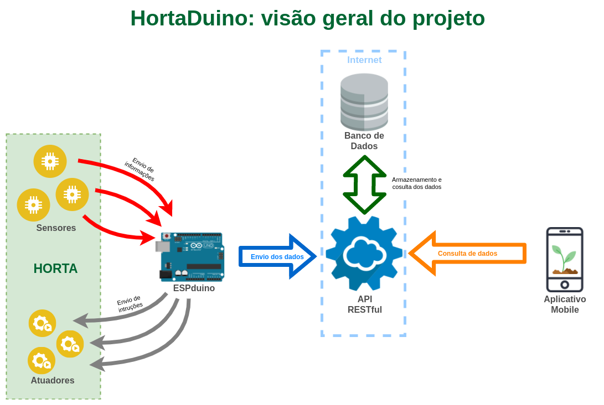

# Colocando a mão na massa!

Agora que tudo que precisamos para que possamos programar o ESPduino foi instalado e com os materiais em mãos, vamos implementar o projeto HortaDuino.

Antes de mais nada, é necessária a compreensão de como funciona o HortaDuino como um todo, assim, a imagem abaixo fornece uma visão geral de como as coisas se interligam em nosso projeto:

Como podemos perceber no esquema, o HortaDuino é composto por vários recursos e componentes que estão interligados.

A horta é por onde tudo começa, pois é o cenário onde o HortaDuino destina-se a ser implantado. Nela estão dispostos os sensores e os atuadores do projeto.

Os sensores desempenham o papel de coletar os dados da horta, permitindo que informações do ambiente, como umidade do solo, sejam coletadas em forma de números para que possam ser enviados ao ESPduino. Ainda na horta, se situam os atuadores. Eles são responsáveis por realizar as ações na horta, como por exemplo, acionar a válvula que fornece água para as mangueiras de irrigação. Os atuadores, assim como os sensores, são controlados pelo ESPduino, que é capaz de receber os dados dos sensores e, a partir de uma lógica, decidir quando ativar ou desativar um atuador.

O ESPduino é uma das partes mais importantes do projeto, pois é nele que se concentra toda a logica que define as interações com a horta. Essa lógica é toda definida por meio da programação do ESPduino utilizando-se uma linguagem para tal (geralmente C/C++), porém, no HortaDuino a programação pode ser toda feita com a plataforma Ardublock, sem a necessidade do domínio de uma linguagem de programação de mais baixo nível e mais complexa.

Com esses componentes até então citados (sensores, atuadores e o ESPduino), já é possível se obter um sistema de irrigação funcional, porém, apenas esses componentes não são o suficiente para que possamos também monitorar a horta, que é justamente o diferencial do HortaDuino. Para tal, é necessária a implantação das demais partes que compõem o esquema apresentado, pois elas correspondem justamente a disponibilização dos dados da horta para que sejam acessíveis de qualquer lugar.

Desta forma, como os dados que queremos monitorar se concentram no ESPduino, é necessário então que os mesmos sejam enviados para um "lugar" acessível a qualquer momento e por qualquer meio. Assim, a melhor estratégia a se usar é enviar esses dados para algum recurso que os torne visíveis na internet.

Neste ponto, justifica-se a vantagem da escolha do ESPduino, pois por já possuir  a conectividade via WIFI nativa, basta programá-lo para que ele se conecte a uma rede WIFI e envie os dados coletados para uma base de dados na internet, por exemplo.

Entretanto, mesmo com o problema da conexão com a internet resolvido, precisa-se saber para onde enviar os dados. Assim, a estratégia usada no HortaDuino é o uso de uma API RESTful que, resumidamente, nada mais é do que um recurso que possibilita que dispositivos distintos consigam acessar dados provenientes de uma ou várias fontes de uma forma unificada e simples.

Na idealização do HortaDuino, foram analisados vários serviços disponíveis na internet que se propõem a oferecer essa API RESTful e um armazenamento para os dados, contudo, tais serviços acabaram ficando apenas como possíveis opções, já que na maioria deles é necessária a criação de uma conta, configuração, estruturação, entre outras coisas que variam de opção para opção, o que foge da ideia do HortaDuino, pois acabaríamos nos atendo a algum serviço em específico. Sendo assim, apenas para demonstração e fins didáticos, para o projeto foi criada uma pequena e simplificada API RESTful usando o framework de desenvolvimento web Django, a qual está instalada na plataforma Heroku e seu código fonte pode ser baixado em seu repositório.

Essa API RESTful, basicamente fornece um meio em que, o ESPduino envia os dados para a API, ela os armazena em um banco de dados e posteriomente os torna acessíveis por meio de um link, como se fosse uma página web qualquer.

Por fim, agora com os dados coletados pelo ESPduino disponíveis para acesso via internet, podemos então monitorar as informações que estão sendo geradas pela horta em tempo real e de qualquer lugar. Além disso, A API RESTful possibilita que qualquer dispositivo acesse os dados da horta, propiciando, por exemplo, a possibilidade de criar-mos um aplicativo de celular para o monitoramento e, até mesmo, o controle da horta independente do local ou do horário.

Nos tópicos seguintes, será explicado, passo a passo, como que é realizada a montagem dos circuitos, como é feita a programação e como conectar tudo com a internet. Para facilitar o entendimento e o aprendizado, cada parte do HortaDuino possui uma explicação dividida no que chamaremos de "projetos", sendo que, cada projeto está ordenado de acordo com o seu nível de evolução e facilidade.

  
  
  
  
  

   
[( << ) Requisitos de Software ](software.md)       
     
[Projeto 1: Trabalhando com sensores e atuadores ( >> )](projeto01.md)