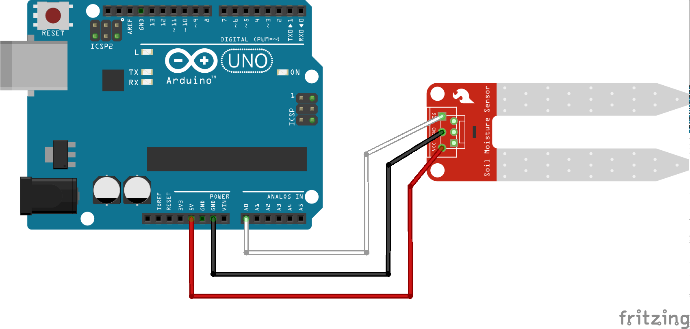
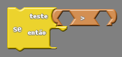
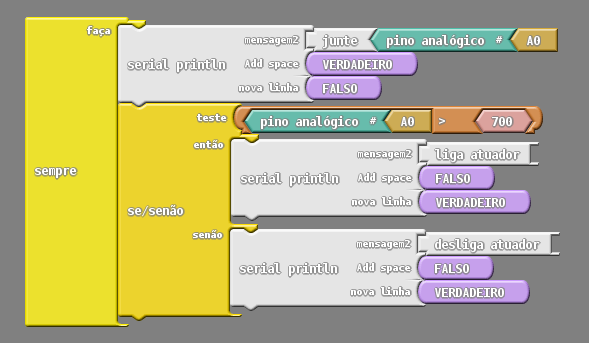
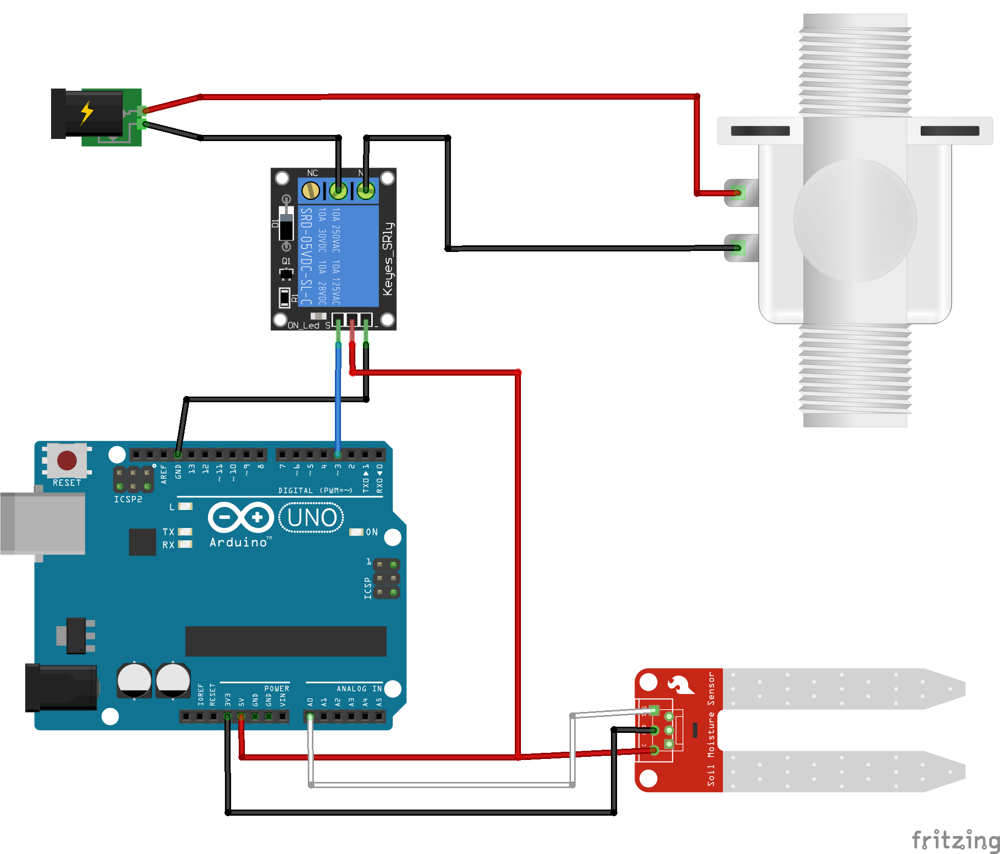
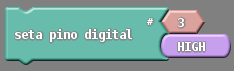
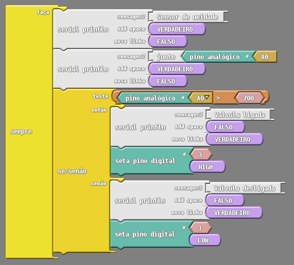

# Projeto 1: Trabalhando com sensores e atuadores

Em nosso primeiro projeto vamos exemplificar como usar os sensores e os atuadores necessários para o HortaDuino. Será mostrado como que o circuito pode ser montado e como programar o ESPduino para que possamos coletar dados com o sensor de umidade do solo.

## Parte 1: utilizando o sensor de umidade do solo

Nessa primeira parte faremos a integração do sensor de umidade com o ESPduino, para isso precisaremos dos seguintes materiais:

- 1 Placa de prototipagem (ESPduino ou Arduino UNO)
- 1 Sensor de umidade do solo

### Montando o circuito

A montagem do circuito usando os materiais é bastante simples, conforme pode ser visto no esquema a seguir:

Para conectar o sensor de umidade na placa basta realizar-mos as seguintes conexões:

1. O pino "VCC" do nosso sensor deve ser ligado em um pino de "5v" da nossa placa de prototipagem (fio vermelho);

2. O pino "GND" do sensor deve ser ligado em um pino "GND" da placa de prototipagem (fio preto);

3. O pino "SIG" ou "Signal" do sensor é o pino em que os dados serão enviados para a placa de prototipagem, portanto ela pode ser conectada com qualquer um dos pinos analógicos da nossa placa de prototipagem, no exemplo usamos o pino "A0" (fio branco);

4. Em alguns sensores de umidade pode haver um quarto pino, ele é destinado para a realização de leituras usando o sinal digital, mas não o usaremos em nosso projeto.

### Programação

Com os componentes conectados vamos agora realizar a programação da lógica para a leitura dos dados do nosso sensor. Como citado anteriormente, usaremos o Ardublock para programar-mos a nossa placa de prototipagem.

Primeiramente precisamos capturar o dado que o nosso sensor de umidade está coletando, para isso usaremos o bloco de pino analógico com o valor do pino "A0":

Sabendo o valor que está sendo coletado pelo sensor, podemos estabelecer alguma lógica para realizarmos alguma ação dependendo do valor que for coletado. Assim, podemos verificar quando o nível de umidade do solo da horta está abaixo ou acima do esperado, para isso vamos testar o valor do sensor com o bloco "teste" e usando o bloco de comparação ">":

Os valores lidos pelo sensor de umidade variam de 0 e 1023, sendo que valores baixos representam maior umidade do solo e valores altos representam menor umidade do solo. Sabendo disso, testaremos quando o valor estiver acima de 700 (solo bastante seco) e realizaremos algo a partir desse teste, deixando nosso código semelhante ao da imagem abaixo:

Nota-se, que usando o bloco de teste teremos duas situações possíveis, a se o nosso teste for verdadeiro (valor lido acima de 700), ou falso (valor lido abaixo de 700). Caso o teste for verdadeiro podemos mandar um sinal para algum atuador ser ligado para efetuar a irrigação pois a umidade está baixa. Quando o nosso teste for falso, a terra estará com umidade suficiente, portanto, podemos desativar o nosso atuador.

Nessa primeira parte apenas está sendo mostrado os valores e quando o teste é verdadeiro ou falso. A ativação de um recurso de irrigação será vista em seguida na parte 2 do projeto.

## Parte 2: ativando a válvula solenóide

Como a parte da verificação da umidade do solo já funcionando, vamos incrementar o nosso projeto para que de fato a horta comece ser irrigada automaticamente quando a terra estiver muito seca. Para isso utilizaremos alguns novos materiais:

- 1 Placa de prototipagem (ESPduino ou Arduino UNO)
- 1 Sensor de umidade do solo
- 1 Válvula solenóide 1/2' x 1/2' 12v
- 1 Fonte de energia de 12v
- 1 Módulo Relé 12v

### Montando o circuito

Agora o nosso circuito terá tanto o sensor de umidade quanto uma válvula que será nosso atuador. Essa válvula será responsável por ligar ou desligar o fluxo de água das mangueiras que irrigarão da horta, como se fosse uma espécie de "torneira eletrônica" e será ativada ou desativada conforme o nível de umidade da terra da nossa horta.   

As ligações que temos que fazer estão amostradas na imagem. Para ligar-mos o sensor de umidade na placa de prototipagem basta fazer as mesmas conexões que fizemos na parte 1 do projeto;

1. O pino "VCC" do nosso sensor de umidade deve ser ligado em um pino de "5v" da nossa placa de prototipagem (fio vermelho);

2. O pino "GND" do sensor deve ser ligado em um pino "GND" da placa de prototipagem (fio preto);

3. O pino "SIG" ou "Signal" do sensor é o pino em que os dados serão enviados para a placa de prototipagem, portanto ela pode ser conectada com qualquer um dos pinos analógicos da nossa placa de prototipagem, no exemplo usamos o pino "A0" (fio branco);

4. O pino "VCC" ou "+" do módulo relé, deve ser conectado em um pino de "5v" da nossa placa de prototipagem (fio vermelho). Caso a placa de prototipagem não tenha dois pinos de "5v" disponíveis podemos fazer como na imagem e usar o mesmo tanto para o módulo relé quanto para o sensor de umidade.

5. O pino "GND" ou "-" do módulo relé, deve ser conectado a um pino "GND" da placa de prototipagem (fio preto);

6. O pino "S" ou "Signal" do módulo relé, diferentemente do sensor de umidade, deve ser conectado em um pino digital da placa de prototipagem, pois ele é ativado em sinal de nível alto e desativado em sinal de nível baixo. No exemplo estamos usando o pino digital "3" da placa de prototipagem (fio azul);

7. No outro lado do módulo relé, o pino "NA" (Normalmente Aberto) deve ser conectado no terminal negativo da válvula solenoide (fio preto);

8. O pino "C" (Comum) do relé, deve ser conectado ao fio negativo da fonte (fio preto);

9. Por fim, o terminal positivo da válvula deve ser conectado diretamente no fio positivo da fonte.   

### Programação

Depois de tudo conectado, vamos partir para a criação de uma lógica que possibilite que, dependendo da umidade da terra, a válvula solenóide seja ligada ou desligada para liberar o fluxo de água para as mangueiras de irrigação.

Nessa segunda parte do projeto vamos continuar de onde paramos na parte 1, portanto já sabemos como testar quando o solo está seco ou húmido, basta ativarmos ou desativarmos a irrigação no momento certo. Para isso vamos precisar apenas 1 único bloco a mais do que no nosso programa anterior, o bloco "seta pino digital", que ativará ou desativará a nossa válvula.

Como podemos ver na imagem do bloco, para ativar ou desativar um pino digital, basta que informemos qual o pino (no nosso projeto usamos o 3) e qual o valor que ele vai receber: "HIGH" para mandarmos um valor alto para o pino e "LOW" para mandarmos um valor baixo para o pino. Desta forma, dependendo da umidade lida pelo sensore de umidade do solo, podemos ativar ou desativar a nossa válvula:

Agora, se o valor recebido do sensor de umidade for maior que 700 ("solo seco"), ligamos a válvula solenóide setando o valor "HIGH" para o pino 3 (que está ligado no módulo relé). Caso o sensor de umidade coletar um valor menor que 700 (solo não tão seco) então desligamos a válvula desligada, pois não é preciso irrigação.

 
 
 
 
 

   
[( << ) Colocando a mão na massa! ](maonamassa.md)      

[Projeto 2: Comunicando com a internet ( >> )](projeto02.md)