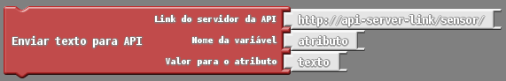

# Projeto 2: Comunicando com a internet

Neste segundo projeto, será explicado como que podemos conectar o nosso ESPduino com a Internet e como enviar e receber dados por meio de uma API. Assim como no primeiro projeto, será explicado o que será necessário e passo a passo para a realização de cada parte do projeto.

Como material, será necessário apenas uma placa de prototipagem que possibilite acesso à Internet. Para este projeto estaremos utilizando o ESPduino, pois com ele é possível utilizar os mesmos recursos de uma placa Arduino Uno, porém com o diferencial do ESPduino já possuir a tecnologia wifi integrada por padrão.

## Parte 1: conectando o ESPduino em uma rede WIFI  

O processo para conectarmos o ESPduino em uma rede Wifi não é necessária a adição de nenhum componente extra na placa de prototipagem.

Para conectar o ESPduino em uma rede Wifi basta utilizarmos o bloco “Config. Station”, que pode ser encontrado no menu “ESP” do Ardublock.

Como podemos ver na imagem acima, o bloco “Config. Station” necessita que informemos o “Login (SSID) Wifi” e “Pwd”. O “Login (SSID) Wifi” nada mais é que o nome da rede Wifi a qual queremos conectar o nosso ESPduino. Já “Pwd” refere-se à senha da rede Wifi  que informamos em “Login (SSID) Wifi”. 

No bloco da imagem exemplificamos a conexão com a rede Wifi com o nome de “rede_wifi”, cuja senha é “senha_da_rede”. 

Feita adição desse bloco em nosso algoritmo e informando os dados do nome da rede e senha corretamente, basta enviarmos o código para o ESPduino para que a conexão com a rede seja realizada.

## Parte 2: enviando e recebendo dados de uma API RESTful

Agora que já sabemos como conectar o ESPduino em uma rede Wifi, vamos para a segunda parte do nosso projeto: enviar e receber dados pela Internet. Nesta parte do projeto estaremos utilizando como exemplo o acesso a uma simples API RESTful, que recebe e responde requisições com dados no formato JSON e os armazena em um banco de dados online. Essa API foi desenvolvida utilizando o framework para desenvolvimento de aplicações web Django e seu código também está disponível para download e modificação. Atualmente a API utilizada para esse projeto pode ser acessada pelo link: https://api-sensores.herokuapp.com/

É importante lembrar, que o exemplo que estaremos apresentando se aplica para o acesso a qualquer API RESTful, desde que a mesma utilize JSON como notação para transferência de dados.

### Enviar dados para a API

Para o envio de um dado do ESPduino para uma API no Ardublock são disponibilizados dois blocos no menu “API”: o bloco “Enviar texto para a API” e o bloco “Enviar número para a API”.

Como o próprio nome de cada bloco já sugere, o bloco “Enviar texto para a API” utilizamos quando queremos fazer o envio de um dado do tipo texto para uma API e o bloco “Enviar número para a API” é utilizado caso queiramos enviar um dado do tipo numérico. Abaixo podemos visualizar esses blocos.

 

Como pode ser observado nas imagens dos blocos, eles necessitam de 3 informações para enviar um dado para a API. Primeiramente é necessário informar o “Link do servidor da API” que nada mais é que o link para o endereço em que a API está acessível a partir da Internet, note que o link pode ser subdividido em 2 partes: a primeira parte “http://api-server-link/” corresponde ao endereço da API como um todo, e a segunda parte “sensor/” corresponde para qual sensor (neste caso) que queremos adicionar/enviar um novo registro. 

A segunda informação a ser informada é o “Nome da variável”, que corresponde a qual atributo do sensor em questão que estamos atribuindo/enviando um novo valor. Caso você não esteja familiarizado com essa nomenclatura, ela refere-se às partes da representação de um registro no formato JSON e abaixo exemplificamos de forma simplificada como é essa representação:

Nessa primeira imagem está representado a estrutura de um registro no formato JSON, note que um registro inicia com o símbolo “{” e termina com o símbolo “}”. Um atributo (ou variável) pode ser visto como se fosse um identificador de um determinado dado dentro do registro. Para deixar mais claro, vamos supor que queremos criar um novo registro descreva algumas informações de uma pessoa, esse registro seria semelhante a imagem abaixo:

Perceba que o registro representa uma pessoa e para ela temos 3 atributos/variáveis: “nome”, “idade” e “sexo”, assim, cada atributo seria como uma característica dessa pessoa.

Voltando agora para os blocos, a última informação corresponde justamente ao valor que queremos atribuir para o atributo que informamos como segundo parâmetro do bloco. Seguindo o exemplo anterior, supondo agora que o registro possua apenas a variável “nome”, para o envio do valor “Joao” para a variável “nome” nosso bloco ficaria da seguinte forma:

#### Exemplo completo

Agora que sabemos o que é necessário para a utilização dos blocos de envio de dados, vamos partir para o exemplo de um algoritmo completo.

Sempre antes de realizar uma operação de comunicação que necessite de conexão com a Internet, é necessário executar o procedimento demonstrado na parte 1 deste projeto, ou seja, realize a conexão com uma rede Wifi. Feito isso, sem nenhum mistério, basta apenas conectar no algoritmo o bloco de envio de dados desejado.

A seguir é apresentado um exemplo de algoritmo completo para o envio do valor “1234” da variável “valor”, para o sensor “sensorumidade/” na API anteriormente mencionada.

### Receber dados da API

O recebimento de dados de uma API no ESPduino é bastante semelhante ao envio, porém só há blocos para o recebimento de números na versão atual do Ardublock. O bloco do disponível para receber um número da API é o “Receber número da API”. Assim como nos blocos de envio de dados, é necessário informar como primeiro parâmetro o  “Link do servidor da API”. A segunda informação necessária é o “recurso da API”, que corresponde ao identificador de qual registro que se deseja receber dados. Por último, deve-se informar nome da variável que armazenará o dado que será recebido da API, essa variável será criada e estará acessível a partir de seu nome em todo o algoritmo.

Abaixo um exemplo completo do recebimento do valor de um determinado recurso da API que está acessível pelo link: https://api-sensores.herokuapp.com/sensorumidade/

No exemplo da imagem acima, primeiramente conecta-se o ESPduino em uma rede Wifi com o bloco “Config. Station”, em seguida, o dado do recurso “1” da API é recebido e armazenado na variável “nome_da_variável”. O valor recebido e armazenado na variável “nome_da_variável” é escrito na saída serial do ESPduino. Por fim, é utilizado o bloco “delay MILLIS” com o valor 30000, que fará com que a execução do algoritmo pause por 30 segundos e em seguida continue, voltando para o início. Como resultado, esse algoritmo irá receber novamente o valor da API a cada 30 segundos.

**OBS.: Por limitações das bibliotecas de comunicações utilizadas na implementação dos blocos de envio e recebimento de dados, o protocolo HTTPS não é suportado. Portanto informe como link para a API somente links HTTP.** 

 
 
 
 
 

   
[( << ) Projeto 1: Trabalhando com sensores e atuadores ](projeto01.md)         

[Projeto 3: Enviando os dados da horta para a Internet ( >> )](projeto03.md)