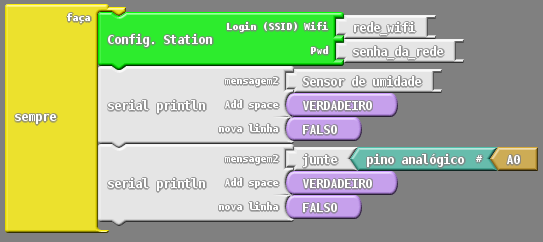
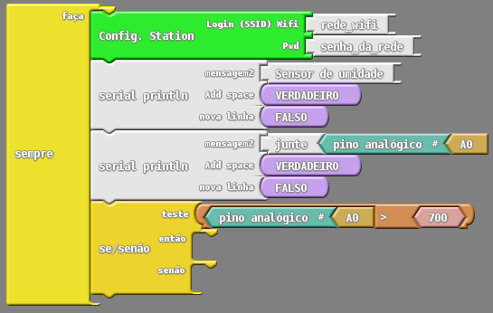
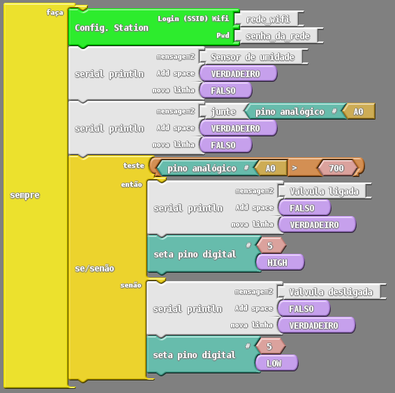
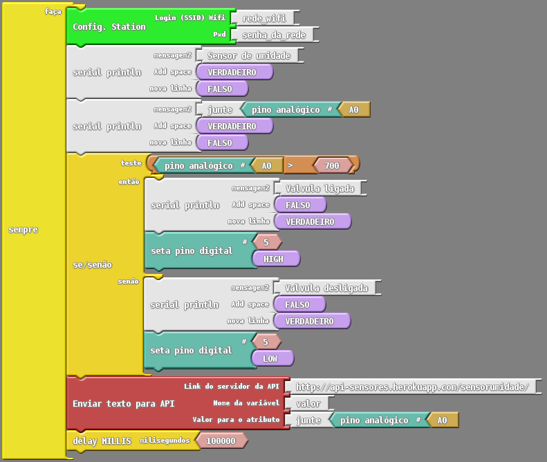

# Projeto 3: Enviando os dados da horta para a Internet

Os projetos 1 e 2, que vimos até agora, apresentaram como que cada parte do projeto HortaDuino funciona de forma individual. No Projeto 1, foi explicado como que os sensores e atuadores funcionam, bem como o processo de montagem e programação desses componentes. Já no Projeto 2, foram explicado como que podemos fazer com que o ESPduino se conecte com a Internet e envie e receba dados por meio de uma API RESTful. Sendo assim, agora temos conhecimento suficiente para automatizar a irrigação da horta e também visualizar os dados coletados dos sensores, e é justamente o que faremos em nosso Projeto 3, juntar as coisas e fazer com que funcionem de forma integrada. 

Neste projeto, vamos partir do princípio de que os projetos anteriores (1 e 2) já tenham sido vistos, por isso, não será explicado novamente como os componentes são ligados no ESPduino, nem explicações aprofundadas sobre os blocos de programação já mencionados nos projetos anteriores.

Como o desafio deste projeto é fazer com que as coisas funcionem juntas, é importante que sigamos uma ordem lógica para o funcionamento do nosso sistema. A seguir, é apresentada uma pequena lista contendo as 5 etapas que seguiremos no algoritmo que construiremos:

1. Conectar o ESPduino em uma rede Wifi;

2. Conectar o sensor de umidade com o ESPduino;

3. Testar se o dado sensor de umidade indica solo seco ou úmido;

4. Ativar ou desativar o atuador conforme a umidade do solo;

5. Enviar os dados coletados pelo sensor para uma API.

#### 1 - Conectar o ESPduino em uma rede Wifi
Como mencionado no Projeto 2, sempre que for necessário Internet no projeto, a primeira coisa a se fazer é conectar o ESPduino em uma rede Wifi:

#### 2 - Conectar o sensor de umidade com o ESPduino

Feita a conexão com a Internet, o próximo passo será conectar o sensor de umidade do solo no ESPduino (processo explicado no Projeto 1):

Note que o sensor de umidade foi conectado no pino analógio A0 do ESPduino e os dados coletados estão sendo exibidos na saída serial do ESPduino logo após a mensagem “Sensor de umidade”.

#### 3 - Testar se o dado sensor de umidade indica solo seco ou úmido

Com o sensor já conectado e coletando dados, vamos agora verificar se o solo está úmido ou seco para posteriormente ligar ou desligar a irrigação na hora certa:

No teste da imagem está sendo utilizado o valor “700”, pois é um valor que geralmente representa o valor que o sensor coleta quando o solo está seco, porém, esse valor pode ser variado conforme a necessidade.

#### 4 - Ativar ou desativar o atuador conforme a umidade do solo

A partir do teste anteriormente realizado é possível identificar quando o solo está seco ou quando está úmido, assim é possível fazer com que a irrigação seja iniciada quando o solo está seco, ou parada quando o solo já estiver úmido. Para ligar e desligar as mangueiras de irrigação utilizaremos uma válvula solenóide, cujo funcionamento também já foi descrito no Projeto 1.

Como a válvula está ligada no pino digital 5 do ESPduino, alternamos o seu estado para ligada ou desligada alternando entre os valores: “LOW” para desligada e “HIGH” para ligada.

#### 5 - Enviar os dados coletados pelo sensor para uma API

Neste passo, vamos realizar o envio dos dados que estão sendo coletados pelo sensor de umidade, de 100 em 100 segundos, para a API mencionada no Projeto 2 (https://api-sensores.herokuapp.com/sensorumidade/).

Com esse algoritmo resultante e, com a montagem correta do circuito, temos um sistema de irrigação automatizado para a horta e que se comunica com a internet. Apesar de ser bem simples, esse sisteminha já é uma boa base para que se explore outras ideias e melhorias.

  
  
  
  
  

   
[( << ) Projeto 2: Comunicando com a internet ](projeto02.md)  

[Projeto 4 - Criando um aplicativo que acessa os dados enviados para a API ( >> )](projeto04.md)