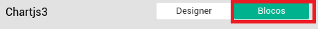
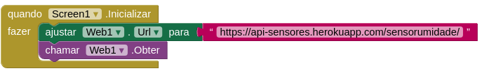

# Projeto 4 - Criando um aplicativo que acessa os dados enviados para a API

Para demonstrar uma das possíveis aplicações e uso dos dados coletados pelos sensores e armazenados no banco de dados online por meio da API, em nosso quarto Projeto será explicado como desenvolver um aplicativo para smartphones como um exemplo das possíveis formas de realizarmos o monitoramento da horta.

Seguindo a proposta dos projetos anteriores, estaremos usando para desenvolver o nosso aplicativo o recurso de programação com blocos. Para isso, estaremos utilizando a plataforma Thunkable, uma ferramenta para o desenvolvimento de aplicativos móveis para os sistemas operacionais Android.

## Criando um projeto no Thunkable
1. Primeiramente acesse http://app.thunkable.com/login/ e realize o login na plataforma, caso ainda não tenha uma conta, você poderá criar uma.

2. Já logado na plataforma crie um novo projeto, clicando no botão “Iniciar novo projeto...”, preencha o campo “Nome do projeto” na janela que foi aberta e logo em seguida clique no botão “OK”, conforme mostrado na imagem abaixo:

3. Pronto! Seu projeto do Thunkable foi criado e agora basta você clicar nele para iniciar a construção do seu aplicativo.

## Instalando a extensão Taifun Tools
Para criar o nosso aplicativo contendo gráficos, será necessária a utilização de algumas funções nativas do smartphone. Para possibilitar essas funções vamos precisar adicionar a extensão “Taifun Tools” no projeto do Thunkable. A instalação dessa extensão pode ser feita conforme explicado a seguir:

1. Baixe o arquivo .aix da extensão Taifun Tools através do link: https://downloads.sourceforge.net/project/puravidaapps/com.puravidaapps.TaifunTools.aix .

2. Após o download, na paleta do seu projeto clique na opção “Extension” no menu e em seguida em “Import extension”, conforme a imagem:

3. Na janela aberta, clique em “Escolher arquivo” e selecione o arquivo “com.puravidaapps.TaifunTools.aix” obtido no passo 2 e depois clique em “Import”:

4. Em caso de sucesso no passo anterior, a extensão já estará acessível na paleta de seu projeto:

5. Para poder utilizar os recursos da extensão que você instalou, basta clicar em cima do nome da extensão na paleta e arrastá-la até a imagem de visualização do seu dispositivo, igual ao processo realizado para qualquer outro componente da paleta.

6. Com o componente da extensão adicionada ao seu app, você já terá acesso aos recursos dessa extensão, tanto na aba “Designer” da plataforma, quanto na aba “Blocos”.

## Adicionando blocos para gráficos
Nativamente a plataforma Thunkable não possui o componente de gráficos e, para possibilitar essa recurso no aplicativo estaremos utilizando uma implementação independente de um usuário (https://community.thunkable.com/u/kevinkun) da comunidade Thunkable. A seguir os passos para adicionar a funcionalidade de gráficos ao seu projeto.

1. Faça o download do arquivo [Chartjs3.aia](https://community.thunkable.com/uploads/default/original/3X/b/f/bfea0e08a6ebdee3f01fd7ceea1865acf47494a8.aia ).

2. Em seguida, clique em “Projetos” no menu superior da plataforma e em seguida clique em “Importar projeto (.aia) do meu computador”. Na janela que abrir clique em “Escolher arquivo” e selecione o arquivo que você baixou anteriormente e após clique em “OK”.

3. Após importar o projeto, o mesmo estará disponível entre seus projetos com o nome de “Chartjs3”. Abra o projeto e clique na aba “Blocos”.

4. Com a aba de blocos aberta, copie para a mochila os blocos de Procedimentos: “ShowChart”, “MakeWebString” e “Join”. Para adicionar um bloco na mochila, clique com o botão direito do mouse sobre o bloco que deseja adicionar e depois clique na opção “Adicionar à mochila”.

 

 

5. Com os blocos já adicionados na mochila, você pode voltar para o seu projeto do Thunkable que você deseja utilizar os gráficos. Certifique-se de ter trocado para o seu projeto para poder realizar os próximos passos.

6. Faça o download do arquivo [chart.zip](https://community.thunkable.com/uploads/default/original/3X/b/4/b4461ec644f5e09d101d8c3e3cf8fe669e371de4.zip) e depois descompacte-o. A descompactação resultará na pasta “chart” e dentro dela estarão os arquivos “chart.html” e “Chart.min.js”.

7. Em seu projeto, clique no botão “Enviar Arquivo” do menu “Mídia”, do lado direito da pré-visualização do seu aplicativo. Após clicar no botão uma janela se abrirá, então clique em “Select File...” e selecione o arquivo “chart.html” da pasta “chart” do passo 6, logo em seguida clique em “OK”. Repita o procedimento para o arquivo “Chart.min.js”.

 

 

8. Na aba “Designer” do seu projeto Thunkable, vá até o menu “Interface de Usuário” e arraste o componente “NavegadorWeb” para o seu aplicativo.

9. Após adicionar o componente “NavegadorWeb” ao seu aplicativo, vá até a aba “Blocos” da plataforma e arraste para a área de blocos os Procedimentos “ShowChart”, “MakeWebString” e “Join”, que estão na mochila. Feito isso, atualize os parâmetros do procedimento “ShowChart”, trocando as ocorrências de “WebViewer1” para o nome do seu componente NavegadorWeb adicionado anteriormente. Caso você não tenha trocado o nome do NavegadorWeb ele provavelmente estará com o nome “NavegadorWeb1”.

10. Feito todos os passos anteriores, seu projeto já está apto para utilizar gráficos. Como há possibilidade de utilizar vários tipos de gráficos, você pode utilizar como base os gráficos do projeto Chartjs3, importado no passo 3. Você tem a disposição 8 tipos de gráficos que podem ser utilizados:

 - **bar** - Barras verticais
 - **horizontalBar** - Barras Horizontais
 - **stackedBar** - Barras verticais com mais de um valor
 - **doughnut** - Rosquinha
 - **pie** - Pizza
 - **radar** - Radar
 - **polarArea** - Polaridade em área

Para mais detalhes sobre gráficos no Thunkable, você poderá também consultar os links das [Referências](#ref) ao fim deste Projeto.

## Acessando dados de uma API
Neste tópico será demonstrado como construir um aplicativo pelo Thunkable que consiga acessar uma API. Faremos como exemplo, um aplicativo que acessa a API utilizada nos Projeto 2 e 3 e lista os valores armazenados no banco de dados online.

**Link da API RESTful: https://api-sensores.herokuapp.com/sensorumidade/**

1. Primeiramente, crie um novo projeto do Thunkable (o nome fica a sua escolha).

2. Com o projeto aberto na aba “Designer” da plataforma, no menu “Conectividade” da paleta, selecione o componente “Web” e arraste para o seu aplicativo.

3.  Para este aplicativo de exemplo, os dados serão buscados da API logo que a tela principal do aplicativo for iniciada, para isso utilizaremos o bloco “Quando <nome_da_tela>.inicializar”.

4. Nas opções de blocos, no menu da tela (“Screen1”, no caso) estará o componente Web (“Web1”, neste exemplo), clique nele e você verá todos os blocos relacionados a esse componente. 

5. Procure na lista de blocos do componente “Web1” o bloco “Ajustar Web1 .url” e adicione dentro do bloco de inicialização da tela. Logo em seguida adicione um bloco de texto contendo a url (ou link) para a API, conforme a imagem:

6. O processo de buscar os dados da API se chama “requisição”. Para realizar uma requisição para nossa API, acrescente ao algoritmo o bloco “Chamar Web1 .obter”, logo em seguida do bloco que define a url da API.

7. Quando o bloco “Chamar Web1 .obter” é utilizado ele executará o procedimento de busca dos dados da API e, para acessar esses dados, é necessário utilizar o bloco “Quando Web1 .RecebeuTexto”, disponível na lista de blocos de “Web1”.

8. Dentro do bloco “Quando Web1 .RecebeuTexto” vamos definir algumas variáveis locais (acessíveis apenas dentro do bloco) para trabalharmos com os valores retornados da requisição para a API. As variáveis serão: “retornado” que conterá  o valor retornado da requisição (texto em formato JSON) e a variável “lista_registros” que será uma lista de contendo os registros armazenados na API.

9. Para colocar o valor retornado da requisição em uma variável, é necessário primeiro decodificar esse valor. Como sabemos que a API retorna dados formatados em JSON, utilizaremos o bloco “chamar Web1 .DecodificarTextoJson” (disponível no menu “Web1”) e como texto a ser decodificado, passaremos o valor retornado pela requisição que está acessível pela variável “conteúdoDaResposta”, conforme a imagem a seguir:

10. Com o valor resultante da requisição decodificado, podemos acessar a listagem de todos os registros percorrendo a variável “retornado” e, para isso será utilizado o bloco de controle “para cada item da lista” passando a variável “retornado” como parâmetro.

11. Dentro do bloco que percorre a lista de registros resultantes da requisição, conforme cada item dessa lista é acessado, podemos “pegar” apenas os dados relevantes para nosso aplicativo e adicionar em nossa lista personalizada.

12. Como foi explicado no Projeto 2, um registro é composto por uma lista de atributos com seus respectivos valores e esse conjunto formado pelo atributo e seu valor no Thunkable é chamado de “pares chave valor”, onde o nome do atributo passa a ser a “chave” do par e “valor” continua sendo o valor do par. Assim, quando queremos acessar os atributos e seus respectivos valores de um registro será necessário utilizar o bloco “busca nos pares chave”, que irá acessar o atributo passado como parâmetro. Veja o exemplo abaixo para acessar o valor do atributo “idade” de um registro que representa uma pessoa.

13. Sabe-se que os registros da API que estamos utilizando possuem 3 atributos, ou seja 3 chaves: “id” que é o identificador do registro, “timestamp” indicando a data e hora que o registro foi armazenado e “valor” que representa o valor coletado pelo sensor de umidade na horta.

14. Neste aplicativo de exemplo vamos utilizar apenas os valores do atributo “id” e “valor” dos registros, e os adicionaremos na nossa lista personalizada “lista_registros”. Note que estamos “pegando” apenas os valores de “id” e “valor” e entre eles colocamos uma quebra de linha para melhorar a visualização desses valores.

15. Agora que apenas os dados que queremos dos registros foram selecionados, podemos mostrar os valores que adicionamos em “lista_registros”. Para isso, utilizaremos o componente “VisualizadorDeListas” que você poderá encontrar na paleta da aba “designer” no menu “Interface de Usuário” e arrastar para o seu app.

16. Após adicionar o componente “VisualizadorDeListas”, já na aba “Blocos”, clique sobre esse componente e selecione o bloco “ajustar “visualizadorDeListas .Elementos para” e o coloque logo abaixo que percorre os valores retornados da requisição. Como parâmetro, coloque “lista_registros”, isso fará com que cada item do componente “VisualizadorDeListas” seja um valor de “lista_registros”.

17. Por último, basta você compilar o seu aplicativo e executá-lo em um smartphone ou emulador com acesso a internet.

## Um exemplo de aplicativo completo
Você pode baixar um exemplo completo que integra o acesso à API juntamente com a exibição de gráficos e utilizar como base para seus projetos:

**Link para download do projeto Thunkable: [HortaDuino.aia](https://raw.githubusercontent.com/hortaduino/documentacao/master/arquivos/HortaDuino.aia)**

## Referências

- [Beautiful chart maker](https://community.thunkable.com/t/beautiful-chart-maker/19786)
- [Thunkable | Criando Gráficos](https://www.youtube.com/watch?v=W5eobHioWNk)
- [Integrando uma API simples](https://www.youtube.com/watch?v=8h0eL8J-BiE)

 
 
 
 
 

   
[( << ) Home ](README.md)