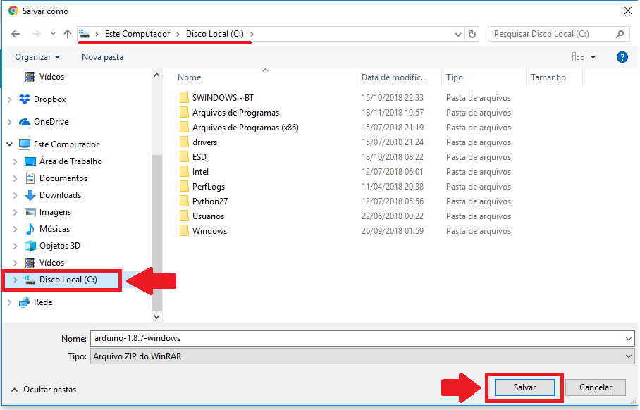
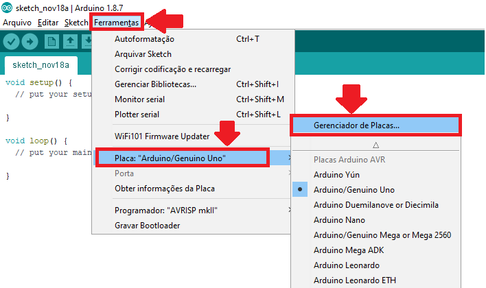

# Requisitos de Software

Para a programação do ESPduino são necessárias algumas ferramentas de software com determinadas configurações. O processo de instalação, configuração e adição dos recursos necessários para o HortaDuino são descritos nos próximos itens.

## Instalação do Arduino IDE

Como ambiente de programação vamos usar o Arduino IDE, editor comumente usado para a criação e envio dos programas para placas de prototipagem como o Arduino e ESPduino. Para instalá-lo basta seguir os seguintes passos:

1. Entre no site [https://www.arduino.cc/en/Main/Software](https://www.arduino.cc/en/Main/Software) e baixe o arquivo .ZIP, conforme a imagem abaixo:


2. Escolha o **Disco Local (C:)** como destino para o arquivo:  


3. Descompacte o arquivo .ZIP baixado;

4. Entre na pasta descompactada e busque pelo ícone do Arduino referente ao executável do Arduino IDE. Para facilitar os posteriores usos, sugere-se a criação de um atalho na Área de Trabalho:  


5. Pronto, instalação concluida!

## Instalação do plugin ESP8266 para uso do ESPduino no Arduino IDE


Como estamos usando o ESPduino como placa de prototipagem e o Arduino IDE é nativamento voltado para o uso com o Arduino, é necessário a instalação do plugin do ESP8266 (microcontrolador do ESPduino) para que possamos programarmos a placa de prototipagem. A instalação desse plugin pode ser feita seguindo os passos abaixo:

 1. Com o Arduino IDE aberto, abra o menu "Arquivo > Preferências" e em seguida, no campo "URLs Adicionais para gerenciadores de Placas" adicione o seguinte link:  
```
    http://arduino.esp8266.com/stable/package_esp8266com_index.json
```


2. Acesse o menu "Ferramentas > Placa > Gerenciador de Placas", conforme a imagem:     



3. Em seguida, procure por "esp8266 Community" e clique em instalar.  


4. Reinicie o Arduino IDE e a opção "ESPduino" já estará entre as placas disponíveis.  


## Adição das bibliotecas necessárias

Além da instalação do plugin, para que o ESPduino funcione perfeitamente com o Arduino IDE, precisamos incluir algumas bibliotecas na pasta "libraries" localizada na pasta onde o Arduino IDe foi intalado. O processo de adição dessas bibliotecas é bem simples:

1. Baixe o arquivo [libraries.zip](https://raw.githubusercontent.com/hortaduino/documentacao/master/arquivos/libraries.zip) e descompacte-o;
2. Após a descompactação haverá uma pasta "libraries", com 3 outras pastas dentro. Selecione todas essas 3 pastas e copie-as:  


3. Vá até a pasta que o Arduino IDE está instalado, procure a pasta "libraries" e cole as 3 pastas copiadas do arquivo baixado para dentro dela.  


4. Por fim, basta reiniciar o Arduino IDE para que as novas bibliotecas sejam carregadas.

* *Caso o Arduino IDE informar que são necessárias atualizações nas bibliotecas: "HttpApi_Esp8266", "Duinoedu_ESP8266" e "ArduinoJson", **NÃO AS ATUALIZE**, pois isso poderá ocasionar mal funcionamento em alguns recursos do Ardublock.*

## Instalação do Ardublock

Como o HortaDuino se apresenta como uma proposta para o ensino de programação nas escolas, um fator de grande importância que também foi pensado é as formas de abstrair a complexidade dos códigos da programação das placas de prototipagem, já que comumente são usadas linguagens como C/C++ que adicionam um certo grau de complexidade no aprendizado, pois possuem uma sintaxe bem robusta e que pode acabar prejudicando o aprendizado da lógica computacional. Desta forma, toda a programação do ESPduino será feita através de programação visual, ou seja, por um recurso que possibilita a programação por meio de blocos de encaixe, semelhantes a um quebra-cabeças cuja lógica do programa é contruida ao conectar os blocos referentes a cada instrução do programa.

A opção de programação visual utilizada no HortaDuino é o Ardublock, uma plataforma de programação com blocos visuais bastante difundida entre os usuários de Arduino. Entretanto, como em nosso projeto estamos usando o ESPduino, usaremos uma versão modificada do Ardublock, dotada de blocos específicos para a programação do ESPduino.

A instalação dessa versão modificada do Ardublock é bem simples, sendo bastante semelhante a adição de novas bibliotecas. Abaixo o passo a passo da instalação:

1. Baixe o arquivo [tools.zip](https://raw.githubusercontent.com/hortaduino/documentacao/master/arquivos/tools.zip) e descompacte-o;
2. Após a descompactação haverá uma pasta "tools". Dentro dela está a pasta "ArduBlockTool", selecione-a e a copie:   


3. Vá até a pasta que o Arduino IDE está instalado, procure a pasta "tools" e cole a pasta "ArduBlockTool" copiada do arquivo baixado para dentro dela.  


4. Por fim, basta reiniciar o Arduino IDE para que o Ardublock esteja entre as ferramentas do menu "Ferramentas".  


 <br>
 <br>
 <br>
 <br>
 <br>

   
[( << ) Requisitos de Software ](software.md)            

[Colocando a mão na massa! ( >> )](maonamassa.md)